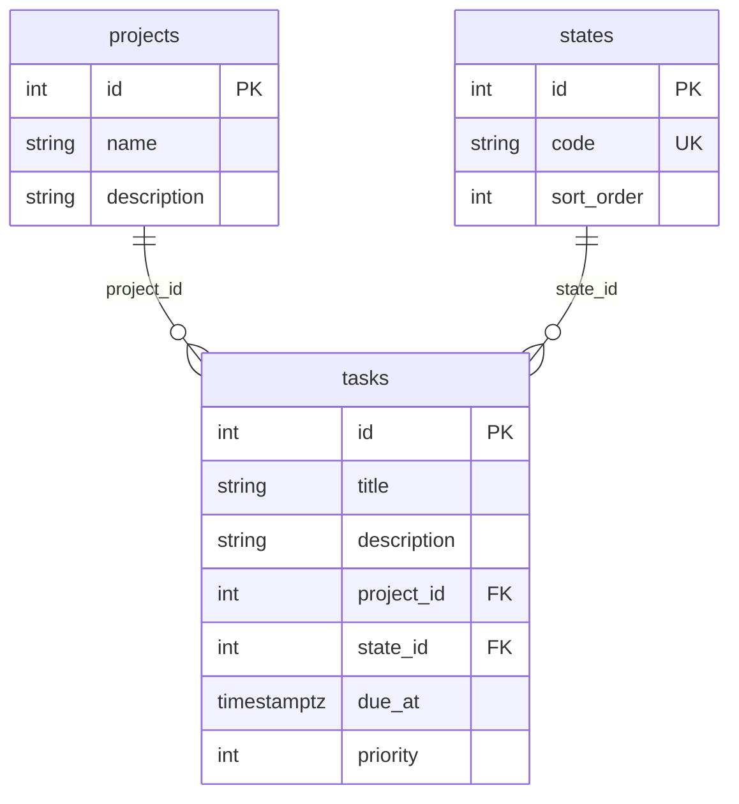

# Esquema de la Base de Datos

Generado a partir del estado real de `app/*.py` y `alembic/versions/`
(cadena de revisiones: `94f759f184a1` → `0b1435f82fdb` → `d1b5f0872ce7` →
`43046c44973e` → `3afb7ddbee5e`). El comportamiento observable de estos
datos vía la API está en [`contrato-api.md`](contrato-api.md); este
documento describe solo estructura.

## Diagrama

## Diccionario de datos

### `states`

Catálogo cerrado — ver [`contrato-api.md#estados`](contrato-api.md#estados).

| Columna | Tipo | Nulo | Significado |
|---|---|---|---|
| `id` | `integer` (PK) | no | |
| `code` | `varchar(32)` (UNIQUE) | no | Los cuatro valores fijos están en el contrato. |
| `sort_order` | `integer` | no | Columna que respalda el "campo de orden del catálogo" que exige el contrato para `GET /states`. |

### `projects`

Ver [`contrato-api.md#proyectos`](contrato-api.md#proyectos).

| Columna | Tipo | Nulo | Significado |
|---|---|---|---|
| `id` | `integer` (PK) | no | |
| `name` | `varchar` (sin longitud máxima) | no | |
| `description` | `varchar` (sin longitud máxima) | sí | |

### `tasks`

Ver [`contrato-api.md`](contrato-api.md), secciones "Tareas v1" y "Tareas v2: Fechas Límite".

| Columna | Tipo | Nulo | Significado |
|---|---|---|---|
| `id` | `integer` (PK) | no | |
| `title` | `varchar` (sin longitud máxima) | no | Se normaliza antes de guardar — ver "Normalización de texto" en el contrato. |
| `description` | `varchar` (sin longitud máxima) | sí | |
| `project_id` | `integer` (FK → `projects.id`) | no | Sin `ondelete`: Postgres rechaza por integridad referencial borrar un proyecto con tareas, no solo por el chequeo `409` de la API. |
| `state_id` | `integer` (FK → `states.id`) | no | Mismo caso que `project_id`: sin `ondelete`. |
| `due_at` | `timestamptz` | sí | El tipo `timestamptz` de Postgres es lo que normaliza a UTC al guardar — ver "Tareas v2" en el contrato para la regla de aceptación (`422` sin zona horaria). |
| `priority` | `integer` | sí | El rango `1`-`5` que exige el contrato no tiene ningún `CHECK` en la base: solo lo valida Pydantic en `app/main.py`. |

## Notas

- No hay discrepancias entre los modelos (`app/*.py`) y las migraciones que los originaron.
- Ninguna columna de texto (`name`, `description`, `title`) tiene longitud máxima a nivel de base.
- No existe ningún índice explícito sobre `tasks.project_id` ni `tasks.state_id`, más allá de las claves primarias y el `UNIQUE` de `states.code`.
